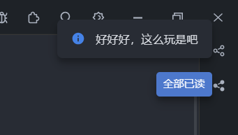

# 弹出提示信息

### 说明：

在右上角弹出指定的消息

​​

### 执行代码：

```javascript
// 定义一个异步函数signMsg()
async function signMsg() {
  // 使用await关键字等待client.pushMsg()方法的返回结果，并将结果赋值给response变量
  const response = await client.pushMsg({
    msg: "好好好，这么玩是吧", timeout: 7000,
  });
  // 打印response的值
  console.log(response);
}

// 调用signMsg()函数
signMsg();
```

‍
